# STL 学习笔记

这是我学习 STL 的笔记。

**更新日志**

- 2019-03-04

新增了[STL 概述与版本简介](#STL 概述与版本简介)、[空间分配器（allocators）](#空间分配器（allocators）)、[迭代器（iterators）](#迭代器（iterators）)、[序列式容器-vector](#vector)

- 2019-03-05

增加了[list](#list)

# 目录

- [STL 概述与版本简介](#STL概述与版本简介)
  - [STL 的历史](#STL的历史)
  - [STL 与 C++ 标准链接库](#STL与C++标准链接库)
  - [STL 六大组件](#STL六大组件)
  - [GNU 源码开放精神](#GNU源码开放精神)
  - [HP 版本](#HP版本)
  - [SGI STL 版本](#SGI-STL版本)
- [空间分配器（allocators）](#空间分配器（allocators）)
  - [分配器的标准接口](#分配器的标准接口)
  - [设计分配器](#设计分配器)
  - [二级分配（sub-allocation）的 SGI 空间分配器](#二级分配（sub-allocation）的SGI空间分配器)
  - [内存基本处理工具](#内存基本处理工具)
- [迭代器（iterators）](#迭代器（iterators）)
  - [迭代器的设计思维——STL 的关键](#迭代器的设计思维——STL的关键)
  - [迭代器是一种 smart pointer](#迭代器是一种smart-pointer)
  - [迭代器相应类型](#迭代器相应类型)
  - [iterator 源码](#iterator源码)
- [序列式容器（sequence containers）](#序列式容器（sequence-containers）)
  - [vector](#vector)
    - [vector 的迭代器](#vector的迭代器)
    - [vector 的数据结构](#vector的数据结构)
    - [vector 的构造与内存管理 constructor, push_back](#vector的构造与内存管理constructor,push_back)
    - [vector 的元素操作 pop_back, erase, clear, insert](#vector的元素操作pop_back,erase,clear,insert)
  - [list](#list)
    - [list的节点Node](#list的节点Node)
    - [list的迭代器](list的迭代器)
    - [list的数据结构](#list的数据结构)
    - [list的构造与内存管理：constructor, push_bask,insert](#list的构造与内存管理：constructor, push_bask,insert)
    - [list的元素操作](#list的元素操作)
  - [deque](#deque)
    - [deque的中控件](#deque的中控件)
    - [deque的迭代器](#deque的迭代器)
    - [deque的数据结构](#deque的数据结构)
    - [deque的构造与内存管理](#deque的构造与内存管理)
    - [deque的元素操作pop_back,pop_front,clear,erase,insert](#deque的元素操作pop_back,pop_front,clear,erase,insert)
  - [stack](#stack)
    - [stack定义式完整列表](#stack定义式完整列表)
    - [stack没有迭代器](#stack没有迭代器)
    - [以list为stack的底层容器](#以list为stack的底层容器)
  - [queue](#queue)
    - [queue定义式完整列表](#queue定义式完整列表)
    - [queue没有迭代器](#queue没有迭代器)
    - [以list做为queue的底层容器](#以list做为queue的底层容器)
  - [heap](#heap)
    - [heap算法](#heap算法)
    - [heap也没有迭代器](#heap也没有迭代器)
  - [priority_queue](#priority_queue)
    - [priority_queue也没有迭代器](#priority_queue也没有迭代器)
  - [slist](#slist)
    - [slist的节点](#slist的节点)
    - [slist的迭代器](#slist的迭代器)
    - [slist的数据结构](#slist的数据结构)

---

# STL源码剖析


SGI STL 版本源码的可读性极佳，运用也最为广泛，是 GNU C++ 的标准链接库，并且开放自由。

日常编程广泛运用的各种数据结构（data structures）和算法（algorithms）在 STL 中有良好的实现，连内存配置与管理也都重重考虑了最佳效能。

STL 源码中有着 vector、list、heap、deque、RB-tree、hash-table、set/map，以及各种算法（排序、搜索、排列组合……）的底层实现。

从技术研究与本质提升的角度看，探究 STL 的细节可以帮助彻底的掌握一切，获得深厚扎实的基础。

SGI STL 称得上是一个一流作品，追踪一流作品并且吸取养分，远比自己关起门来写个三流作品，价值高得多。

## STL概述与版本简介


为了建立数据结构和算法的一套标准，并且降低其间的耦合（coupling）关系以提升各自的独立性、弹性、交互操作性（相互合作性，interoperability），STL 诞生了。

STL 带来了一个高层次的、以泛型思维（Generic Paradigm）为基础的、系统化的、条理分明的「软件组件分类学（components taxonomy）」。

### STL的历史

STL 的创始人：Alexander Stepanov。

Alexander Stepanov 分别􏰄实验了多种架构和算法公式，先以 C 完成，而后再以 C++ 完成。1993 年 11 月完成正式提案，STL 成为 C++ 标准规格的一部分。

### STL与C++标准链接库

Alexander 向 C++ 标准委员提交提案后，STL 在会议中取得了压倒性的胜利。STL 进入了 C++ 标准化的正式流程，C++ 链接库如 stream, string 等也都以template 重新写过 。

### STL六大组件

1. 容器（containers）

各种数据结构，如 vector, list, deque, set, map。可以理解为包含对象的类。

2. 算法（algorithms）

各种常用算法如 sort, search, copy, erase。适用于不同类型容器的函数。

3. 迭代器（iterators）

容器中的“指针”。

4. 仿函式（functors）

STL 包括重载函数调用操作符的类。类的实例称为函数对象或仿函数。函数允许在传递参数的帮助下自定义相关函数的工作。

5. 适配器（adapters）

修饰容器（containers）或仿函式（functors）或迭代器（iterators）。

6. 分配器（allocators）

负责空间分配与管理，即用于分配空间的对象。


#### C++规范

使用无拓展名的头文件。

```c++
#include <vector>
```

### GNU源码开放精神

STL 源码属于 HP 公司拥有，每一个头文件重都有声明。开放源码的精神，一般统称为 open source。

Stallman 于 1984 创立自由软件基金会（Free Software Foundation），简称FSF。

### HP版本

每一个 HP STL 头文件都有如下一份声明。

```
 * Copyright (c) 1994
 * Hewlett-Packard Company
```

### SGI-STL版本

SGI 版􏰁由 Silicon Graphics Computer Systems, Inc. 公司发展，承继 HP 版􏰁。它的每一个头文件也都有 HP 的版􏰁声明。

```
 * Copyright (c) 1996
 * Silicon Graphics Computer Systems, Inc.
```

在我的设备上，STL 源码位于以下目录：

```
/usr/include/c++/4.2.1
```

每一份 STL 源码都包含三个版权声明，如下：

```c++
// Copyright (C) 2001, 2002, 2003 Free Software Foundation, Inc.

 * Copyright (c) 1994
 * Hewlett-Packard Company
 
 * Copyright (c) 1996
 * Silicon Graphics Computer Systems, Inc.
 
 /** @file include/vector
 *  This is a Standard C++ Library header.
 */
```

## 空间分配器（allocators）


整个 STL 的操作对象（所有的数值）都存放在容器之内，而容器一定需要分配空间以置放数据。

```
array_allocator.h
bitmap_allocator.h
debug_allocator.h		# 可以包装任意其它的allocato
malloc_allocator.h	# 包装malloc和free
mt_allocator.h
new_allocator.h  		# 默认使用的allocator
pool_allocator.h		# 唯一一个带内存池的allocator
throw_allocator.h
```

### 分配器的标准接口

打开 new_allocator.h，可以看到 allocator 所提供的接口。


### 设计分配器

```c++
src/my_allocator.h

src/test_my_allocator.cc
```

### 二级分配（sub-allocation）的SGI空间分配器

```
vector<int, std::allocator<int> > iv;
```

#### SGI标准的空间分配器std::allocator

SGI 定义有一个符合部分标准、名为 allocator 的分配器，但是效率不高，只把 C++ 的 ::operator new 和 ::operator delete 做一层封装而已。

#### SGI特殊的空间分配器std::alloc

STL allocator 将内存申请由 alloc:allocate() 负责，内存释放由 alloc::deallocate() 负责，对象构造由::construct() 负责，对象销毁由 ::destroy() 负责。

配置器定义于 `<memory>` 文件中， `<memory>` 中包含：

```C++
#include <bits/allocator.h>			// 负责内存空间的配置与释放
#include <bits/stl_construct.h>	// 负责对象的构建与销毁
```

#### 对象的构造和销毁：construct()和destroy()

`stl_construct.h` 中包含以下函数：


_Construct() 接受一个指针 p 和一个初值 value，此函式的用途就是将初值设定到指针所指的空间上。

```c++
// 销毁将指针所指东西
_Destroy(_Tp* __pointer)

// 销毁[first, last]之间的东西
_Destroy(_ForwardIterator __first, _ForwardIterator __last)
```

#### 空间的申请与释放std::alloc

空间的申请、释放由 `<malloc_allocator.h>` 负责。

SGI 设计了双层级分配器，第一级分配器直接使用 malloc() 和 free()，第二级分配器则视情况采用不同的策略：当分配空间超过 128bytes，便呼叫第一级分配器；当分配空间小于 128bytes，为了降低额外负担，便采用复杂的 memory pool 整理方式，而不再求助于第一级分配器。

#### 第一级分配器

第一级分配器直接使用 `malloc()`，SGI 以 malloc 而非 ::operator new 来分配内存。

#### 第二级分配器

第二级分配器多了一些机制，避免􏰃多小额区块造成内存的碎片。当区块小于 128 bytes，则以 **memory pool** 管理，此法又称为二级分配（sub-allocation）：每次配置一大块内存，并维护对应之自由表（free-list）。下次若再有相同大小的内存需求，就直接从 free-lists 中分出。

```c++
// pool_allocator.h
union _Obj
{
  union _Obj* _M_free_list_link;
  char        _M_client_data[1];    // The client sees this.
};
```

#### 控件分配函数allocate()

此函数首先判断区块大小，大于 128 bytes 就调用第一级分配器，小于 128 bytes  就检查对应的 free list。如果 free list 中有可用的区块，就直接拿来用，如果没有可用区块，就将区块大小上调至 8 倍数边界，然后呼叫refill()，准备为 free list 重新填充空间。 

#### 控件释放函数deallocate()

此函数首先判断区块大小，大于 128 bytes 就调用第一级分配器，小于 128 bytes 就找出对应的 free list，将区块回收。

#### 重新填充free list

free list 中没有可用区块了，就呼叫 refill() 为 free list 重新填充空间。

#### 内存池（memory pool）

判断内存池的剩余容量，然后将空间分配给 free list。

```C++
// 判断内存池的剩余容量
end_free - start_free
```

### 内存基本处理工具

STL 定义有五个函数，作用于􏰅初始化空间上。

前两个是 construct() 和 destroy()，另外三个函数位于 `<stl_uninitialized.h>` 中。


**uninitialized_copy()**

将内存的分配与对象的构造行为分离开来。

它接收 3 个参数：

1. 迭代器 first 指向输入端的起始位置
2. 迭代器 last 指向输入端的结束位置
3. 迭代器 result 指向输出端（欲初始化空间）的起始处

**uninitialized_fill()**

将内存的分配与对象的构造行为分离开来，它要不就产生出所有必要元素，要不就不产生任何元素。

它接收 3 个参数：

1. 迭代器 first 指向输出端（欲初始化空间）的起始处
2. 迭代器 last 指向输出端（欲初始化空间）的结束处
3. x 表示初值

**uninitialized_fill_n()**

将内存的分配与对象的构造行为分离开来，它会为指定范围内的所有元素设定相同的初值。

它接收 3 个参数：

1. first：指向欲初始化空间的起始处
2. n：表示欲初始化空间的大小
3. x：初值

## 迭代器（iterators）


iterator：提供一种方法，是的得可以按顺序访问某个聚合物（容器）所􏰈的各个元素，而又不会暴露该聚合物（容器）的内部实现。

### 迭代器的设计思维——STL的关键

STL 的中心思想在于，将数据容器（containers）和算法（algorithms）分开，彼此独立设计，最后再以一种粘合剂将它们联系在一起。迭代器（iterators）就是联系容器（containers）和算法（algorithms）的粘合剂。

### 迭代器是一种smart-pointer

迭代器是一种行为类似指针的对象，而指针的各种行为中最常见也最重要的便是内容提领（dereference）和成员取用（member access）。迭代器最重要的编程工作就是对 operator* 和 operator-> 进行重载（overloading）工程。

auto_ptr 的源码在头文件 `<memory>` 中。

```c++
// memory
template<typename _Tp>
class auto_ptr
{
private:
  _Tp* _M_ptr;

public:
//....
}
```

每一种 STL 容器都提供有专属迭代器，目的就是为了封装细节不被使用者所看到。

### 迭代器相应类型

算法之中运用迭代器时，很可能会用到其相应类型􏰄（associated type）。

可以使用利用 function template 的自变量推导（argument deducation）机制。

### Traits编程技巧

```
src/my_iter.cc
```

func() 的回返型􏰄必须加上关键词 typename，关键词 typename 的用意在告诉编译器说这是一个类型􏰄。

#### Partial Specialization（偏特化）的意义

```c++
template<typename T>
class C<T*> { ... }; 
```

```c++
template <typename T>
struct iterator_traits<const T*> {
  // 当迭代器是个pointer-to-const
  // 萃取出来的类型应该是 T 而非 const T
  typedef value_type;
};

template <typename I>
typename iterator_traits<I>::value_type
func(I ite) {
  return *ite;
}
```

根据经验，最常用到的迭代器相应型􏰄有五种：value type, difference type, pointer,
reference,iterator catagoly。

```c++
// stl_iterator.h
typename iterator_traits<_Iterator>::iterator_category,
typename iterator_traits<_Iterator>::value_type,
typename iterator_traits<_Iterator>::difference_type,
typename iterator_traits<_Iterator>::pointer,
typename iterator_traits<_Iterator>::reference
```

**value_type**

指迭代器所指对象的类型。

**difference_type**

表示两个迭代器之间的距离。因此，它可以用来表示一个容器的最大容量，因为对于连续空间的容器而言，头尾之间的距离就是其最大容量。

**reference**

C++ 的函数如果要传回左值，都是以 by reference 的方式进行。

**pointer**

能够传回一个 pointer，指向迭代器所指之物。

```C++
Item& operator*() const { return *ptr; }
Item* operator->() const { return ptr; }
```

`Item&` 便是 reference type ， `Item*` 是 pointer type。

**iterator_category**

迭代器的分类：

- Input Iterator：这种迭代器所指对象，不允许外界改变
- Output Iterator：只能写（write only）
- Forward Iterator：读写动作
- Bidirectional Iterator：可双向移动
- Random Access Iterator：涵盖所有算术能力


### iterator 源码

```
iterator
stl_iterator.h
stl_iterator_base_funcs.h
stl_iterator_base_types.h
stl_raw_storage_iter.h
stream_iterator.h
streambuf_iterator.h
```

## 序列式容器（sequence containers）


容器是大多数人对 STL 的第一印象。

**序列式容器**，其中的元素都可序（ordered），但􏰅排序（sorted）。C++ 语言􏰁身提供了一个序列式容器 array，STL 另外再提供 vector, list, deque, stack, queue, priority-queue 等等序列式容器。其中 stack 和 queue 由是将 deque 改头换面而成，技术上被归类为一种适配器（adapter）。

### vector

vector 的数据安排以及操作方式，与 array 非常像似。它们之间的差别在于：

- array 是静态空间，扩容和缩容操作首先配置一块新空间，然后将元素从旧空间一一搬往新空间，然后再把原来的空间释还给系统。

- vector 是动态空间，随着元素的加入，它的内部机制会自行扩充空间以容纳新元素。

```c++
// stl_vector.h
```


#### vector的迭代器

```c++
typedef __gnu_cxx::__normal_iterator<pointer, vector_type> iterator;
typedef __gnu_cxx::__normal_iterator<const_pointer, vector_type> const_iterator;
typedef std::reverse_iterator<const_iterator>  const_reverse_iterator;
typedef std::reverse_iterator<iterator>		 reverse_iterator;
```

vector 支持随机存取，提供的是 Random Access Iterators。

#### vector的数据结构

vector 所采用的数据结构非常简单：线性连续空间。

```c++
struct _Vector_impl : public _Tp_alloc_type
{
	_Tp*           _M_start;					// 表示目前使用空间的头
	_Tp*           _M_finish;					// 表示目前使用空间的尾
	_Tp*           _M_end_of_storage;	// 表示目前可用空间的尾
};
```

vector 实际配置的大小可能比客端需求量更大一些，以备将来可能的扩充。

size 表示元素的个数，capacity 表示 vector 的容量。当增加新元素时，size 增加，当 size 超过容量（capacity）的时候，vector 的容量会增加两倍。如果两倍容量仍不足，就扩张至足够大的容量。

例如下面的例子：

```c++
#include <vector>
#include <cstdio>

using std::vector;

int main() {
  vector<int> vec;
  for (int i = 0; i < 10; ++i) {
    vec.push_back(i);
    printf("capacity=%d, size=%d\n", vec.capacity(), vec.size());
  }
  return 0;
}
```

```shell
// 运行结果
capacity=1, size=1
capacity=2, size=2
capacity=4, size=3
capacity=4, size=4
capacity=8, size=5
capacity=8, size=6
capacity=8, size=7
capacity=8, size=8
capacity=16, size=9
capacity=16, size=10
```

#### vector的构造与内存管理constructor,push_back

vector 提供许多 constructors，其中一个允许我们指定空间大小及初值:

```c++
vector(size_type n, const T& value) {
  fill_initialize(n, value);
}
```

当我们以 push_back() 将新元素安插于 vector 尾端，该函式首先检查是否还有备用空间？如果有就直接在备用空间上建构元素，并调整迭代器 finish，使 vector 变大。如果没有备用空间了，就扩充空间（重新分配、搬移数据、释放原空间）。

```C++
// stl_bvector.h
void _M_insert_aux(iterator __position, bool __x) {
	// 检查是否还有备用空间
  if (this->_M_impl._M_finish._M_p != this->_M_impl._M_end_of_storage)
	{
    // 构造一个新元素
	  std::copy_backward(__position, this->_M_impl._M_finish, 
			     this->_M_impl._M_finish + 1);
	  *__position = __x;
   // 调整 finish 
	  ++this->_M_impl._M_finish;
	}
	else
	{
    // 如果原大小不为 0，则配置原大小的两倍
	  const size_type __len = size() ? 2 * size()
	                                 : static_cast<size_type>(_S_word_bit);
	  _Bit_type * __q = this->_M_allocate(__len);
	  iterator __i = _M_copy_aligned(begin(), __position,
					 iterator(__q, 0));
	  *__i++ = __x;
	  this->_M_impl._M_finish = std::copy(__position, end(), __i);
	  this->_M_deallocate();
	  this->_M_impl._M_end_of_storage = (__q + ((__len
						     + int(_S_word_bit) - 1)
						    / int(_S_word_bit)));
	  this->_M_impl._M_start = iterator(__q, 0);
	}
}
```

所谓动态增加大小，并不是在原空间之后接续新空间（因为无法保证原空间之后尚有可供插入的空间），而是以原大小的两倍另外分配一块空间，然后将原内容拷贝过来，然后才开始在原内容之后插入新元素，并释放原空间。

#### vector的元素操作pop_back,erase,clear,insert

**pop_back**

```c++
// stl_bvector.h

// 将尾部元素拿掉，并调整大小(finish减小)
void pop_back() {
	--this->_M_impl._M_finish;
}


size_type size() const {
  return size_type(end() - begin()); 
}

iterator end() {
  return this->_M_impl._M_finish; 
}

```

**erase**

```C++
// stl_bvector.h

// 清除[first, finish]中的所有元素
// 使用后面的元素覆盖要删除的区间，然后修改 finish 指针
iterator erase(iterator __first, iterator __last) 
{
  _M_erase_at_end(std::copy(__last, end(), __first));
  return __first;
}

void _M_erase_at_end(iterator __pos)
{ 
  this->_M_impl._M_finish = __pos;
}

// 清除某个位置上的元素
iterator erase(iterator __position)
{
  if (__position + 1 != end())
    std::copy(__position + 1, end(), __position);
  --this->_M_impl._M_finish;
  return __position;
}
```

**clear**

```c++
// stl_bvector.h

// 清除所有元素
void clear()
{ 
	_M_erase_at_end(begin());
}

void _M_erase_at_end(iterator __pos)
{ 
  this->_M_impl._M_finish = __pos;
}
```

**insert**

```c++
void _M_insert_aux(iterator __position, bool __x)
{
  if (this->_M_impl._M_finish._M_p != this->_M_impl._M_end_of_storage)
	{
    // 元素后移
		std::copy_backward(__position, this->_M_impl._M_finish, 
			     							this->_M_impl._M_finish + 1);
	  // /从安插点开始填入新值
    *__position = __x;
    // 修改 finish 指针
	  ++this->_M_impl._M_finish;
	}
	else
	{
	// 申请 2 倍的空间
	// ...
	}
}
```

### list

list 每次插入或删除一个元素，就立即分配或释放一个元素空间。list 对于空间的运用有绝对的精准，一点也不浪费。对于任何位置的元素插入或元素删除，list 永远是常数时间。可以这么理解：vector 对应数组，list 对应链表。

#### list的节点Node

```c++
// stl_list.h
struct _List_node_base
{
  _List_node_base* _M_next;   ///< Self-explanatory
  _List_node_base* _M_prev;   ///< Self-explanatory
};

/// @if maint An actual node in the %list.  @endif
template<typename _Tp>
struct _List_node : public _List_node_base
{
  _Tp _M_data;                ///< User's data.
};
```

#### list的迭代器

STL 的 list 是一个双向链表（double linked-list），迭代器必须具备前移、后移的能力。所以 list 提供的是 Bidirectional Iterators。

list 的一个重要性质：插入（insert）、连接（splice）不会造成原有的 list 迭代器失效。这在 vector 中是不成立的。

```c++
// stl_list.h

template<typename _Tp>
struct _List_iterator
{
  typedef _List_iterator<_Tp>                _Self;
  typedef _List_node<_Tp>                    _Node;

  typedef ptrdiff_t                          difference_type;
  typedef std::bidirectional_iterator_tag    iterator_category;
  typedef _Tp                                value_type;
  typedef _Tp*                               pointer;
  typedef _Tp&                               reference;
      

// 对于迭代器的取值，取的是节点的 data
reference operator*() const
{ 
  return static_cast<_Node*>(_M_node)->_M_data;
}
// 迭代器的成员存取
pointer operator->() const
{ 
  return &static_cast<_Node*>(_M_node)->_M_data;
}


// 跌打器加1，就是前进一个节点
_Self& operator++()
{
  _M_node = _M_node->_M_next;
  return *this;
}

// 迭代器减1，就是后退一个节点
_Self& operator--()
{
  _M_node = _M_node->_M_prev;
  return *this;
}
  
};	// struct _List_iterator
```

#### list的数据结构

list 是一个双向的循环链表。

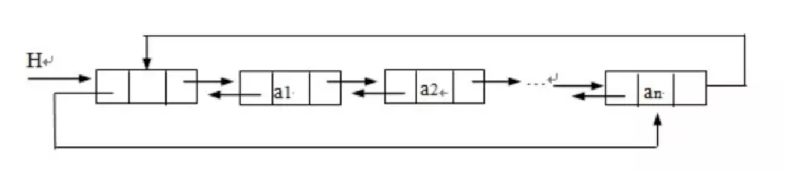

`_Node` 可以转换为迭代器类型：

```c++
protected:
  // Note that pointers-to-_Node's can be ctor-converted to
  // iterator types.
  typedef _List_node<_Tp>				 _Node;
```

```c++
// 取头节点的数值
reference front()
{ 
	return *begin();
}
```

#### list的构造与内存管理：constructor, push_bask,insert

list 使用 Alloc 做为空间分配器，并另外定义了 `_Node_alloc_type` ，为的是更方便的以节点大小为分配单位。

```C++
// 使用 Alloc 做为空间分配器
template<typename _Tp, typename _Alloc>

// 每次配置一个节点大小
typedef typename _Alloc::template rebind<_List_node<_Tp> >::other
        _Node_alloc_type;
```

```c++
// 分配一个节点并返回
_List_node<_Tp>* _M_get_node()
{ return _M_impl._Node_alloc_type::allocate(1); }
      
// 释放一个节点
void _M_put_node(_List_node<_Tp>* __p)
{ _M_impl._Node_alloc_type::deallocate(__p, 1); }

// 分配一个节点，并赋初值
_Node* _M_create_node(const value_type& __x)
{
	_Node* __p = this->_M_get_node();
	try
	{
    _M_get_Tp_allocator().construct(&__p->_M_data, __x);
	}
	catch(...)
  {
    _M_put_node(__p);
    __throw_exception_again;
  }
	return __p;
}


// 删除一个节点
// Erases element at position given.
void _M_erase(iterator __position)
{
  __position._M_node->unhook();
  _Node* __n = static_cast<_Node*>(__position._M_node);
  _M_get_Tp_allocator().destroy(&__n->_M_data);
  _M_put_node(__n);
}
// new_allocator.h
void destroy(pointer __p) { __p->~_Tp(); }
```

list 提供了很多 constructors：

```C++
explicit list(const allocator_type& __a = allocator_type())
      : _Base(__a) { }
```

push_back() 将新元素插入到 list 的尾部：

```c++
void push_back(const value_type& __x)
{ 
  this->_M_insert(end(), __x);
}

// Inserts new element at position given and with value given.
void _M_insert(iterator __position, const value_type& __x)
{
  _Node* __tmp = _M_create_node(__x);
  __tmp->hook(__position._M_node);
}
```

在 list 内的某处插入新节点，首先必须确定安插位置。

```c++
void insert(iterator __position, size_type __n, const value_type& __x)
{  
  list __tmp(__n, __x, _M_get_Node_allocator());
  splice(__position, __tmp);
}

// example: 在ls链表头插入
ls.insert(ls.begin(), 6);
```

list 不像 vector 那样有可能在空间不足时做重新分配、数据迁移的动作，所以插入前的所有迭代器在插入动作之后都仍然有效。

#### list的元素操作

```C++
// 插入一个节点，作为头节点
void push_front(const value_type& __x)
  { this->_M_insert(begin(), __x); }
  
// 插入一个节点，作为尾节点
void push_back(const value_type& __x)
  { this->_M_insert(end(), __x); }

// 删除迭代器 position 所指节点
iterator erase(iterator __position);

// 删除头节点
void pop_front()
  { this->_M_erase(begin()); }

// 删除尾节点
void pop_back()
{ 
  this->_M_erase(iterator(this->_M_impl._M_node._M_prev)); }

```

list 内部提供一个所谓的迁移动作（transfer），将某连续范围的元素迁移到某个特定位置之前。

```c++
// Moves the elements from [first,last) before position.
void _M_transfer(iterator __position, iterator __first, iterator __last)
{
	__position._M_node->transfer(__first._M_node, __last._M_node);
}
```

list 公开提供的是所谓的接合动作（splice）：将某连续范围的元素从一个 list 搬移到另一个（或同一个）list 的某个定点。

```C++
// 将x连接到position所指的位置之前
void splice(iterator __position, list& __x)
{
	if (!__x.empty())
  {
    _M_check_equal_allocators(__x);
    this->_M_transfer(__position, __x.begin(), __x.end());
  }
}

// 将i所指元素连接到__position所指位置之前
void splice(iterator __position, list& __x, iterator __i)
{
	iterator __j = __i;
	++__j;
	if (__position == __i || __position == __j)
	  return;

	if (this != &__x)
	  _M_check_equal_allocators(__x);

	this->_M_transfer(__position, __i, __j);
}

// 将 [first,last) 内的所有元素连接接于 position所指位置之前。
void splice(iterator __position, list& __x, iterator __first, iterator __last)
{
	if (__first != __last)
	  {
	    if (this != &__x)
	      _M_check_equal_allocators(__x);

	    this->_M_transfer(__position, __first, __last);
	  }
}
```

有了 transfer()，merge()、reverse() 和 sort() 的源码并不难实现。

```c++
template<typename _Tp, typename _Alloc>
void list<_Tp, _Alloc>::
merge(list& __x)
{
  // _GLIBCXX_RESOLVE_LIB_DEFECTS
  // 300. list::merge() specification incomplete
  if (this != &__x)
	{
	  _M_check_equal_allocators(__x); 

	  iterator __first1 = begin();
	  iterator __last1 = end();
	  iterator __first2 = __x.begin();
	  iterator __last2 = __x.end();
	  while (__first1 != __last1 && __first2 != __last2)
	    if (*__first2 < *__first1)
	      {
          iterator __next = __first2;
          _M_transfer(__first1, __first2, ++__next);
          __first2 = __next;
	      }
	    else
	      ++__first1;
	  if (__first2 != __last2)
	    _M_transfer(__last1, __first2, __last2);
	}
}
```

### deque

vector 是单向开口的连续线性空间，也就是说，只能从一端进行插入。deque 则是一种双向开口的连续线性空间，可以在头尾两端分􏰁做元素的插入和删除动作。

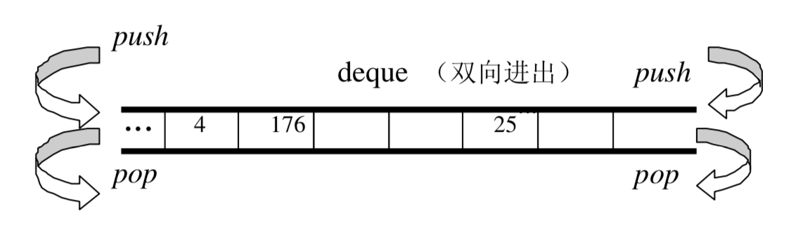

deque 在两端插入或删除，时间复杂度都是常数级的。不同于 vector，如果在头插入，需要将所有元素后移，时间复杂度是线性级别的。

应尽可能选择使用 vector 而非 deque。对 deque 进行的排序动作，为了最高效率，可将 deque 先完整复制到一个 vector 身上，将 vector 排序后（利用 STL sort 算法），再复制回 deque。

#### deque的中控件

deque 由一段一段的定量连续空间构成。一旦有必要在 deque 的前端或尾端增加新空间，便配置一段定量连续空间，串接在整个 deque 的头端或尾端。

为了维护整体连续的假象，数据结构的设计及迭代器前进后退等动作都颇为繁琐。deque 的代码量远比 vector 或 list 多得多。

deque 采用一块 map（一小块连续的控件），其中的每个元素指向另一段较大的连续线性空间，成为缓冲区。缓冲区是 deque 的存储空间主体。

```C++
protected:
	// 元素的指针的指针	
  typedef pointer*	_Map_pointer;


// 每个node都指向一块缓冲区
_Map_pointer _M_node;
```

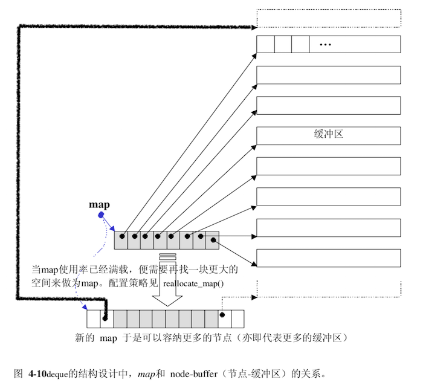

#### deque的迭代器

deque 是分段连续空间。

```c++
template<typename _Tp, typename _Ref, typename _Ptr>
    struct _Deque_iterator	// 未继承 std::iterator
    {
      typedef _Deque_iterator<_Tp, _Tp&, _Tp*>             iterator;
      typedef _Deque_iterator<_Tp, const _Tp&, const _Tp*> const_iterator;

      static size_t _S_buffer_size()
      { return __deque_buf_size(sizeof(_Tp)); }

			// 自行撰写 5 个必要的跌打器类型
      typedef std::random_access_iterator_tag iterator_category; //(1)
      typedef _Tp                             value_type;	// (2)
      typedef _Ptr                            pointer;	// (3)
      typedef _Ref                            reference;	// (4)
      typedef size_t                          size_type;
      typedef ptrdiff_t                       difference_type;	// (5)
      typedef _Tp**                           _Map_pointer;
      typedef _Deque_iterator                 _Self;

      _Tp* _M_cur;	// 此迭代器所指缓冲区的当前（current）元素
      _Tp* _M_first;	// 指向缓冲区的头
      _Tp* _M_last;	// 指向缓冲区的尾
      _Map_pointer _M_node;	// 指向控制中心
      
      // ...
      };
```

```C++
// 决定缓冲区大小的函数
static size_t _S_buffer_size()
      { return __deque_buf_size(sizeof(_Tp)); }

// 如果 sz(元素大小，sizeof(value_type))小于 512，传回 512/sz， 
// 如果 sz 不小于 512，传回 1。
inline size_t
  __deque_buf_size(size_t __size)
  { return __size < 512 ? size_t(512 / __size) : size_t(1); }
```

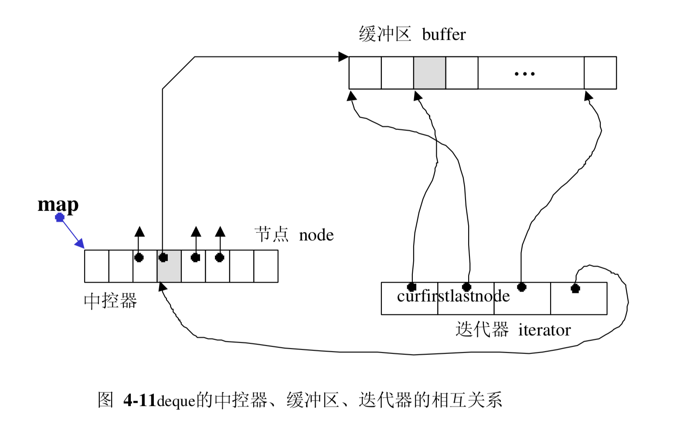

begin() 和 end() 所传回的两个迭代器如下图：

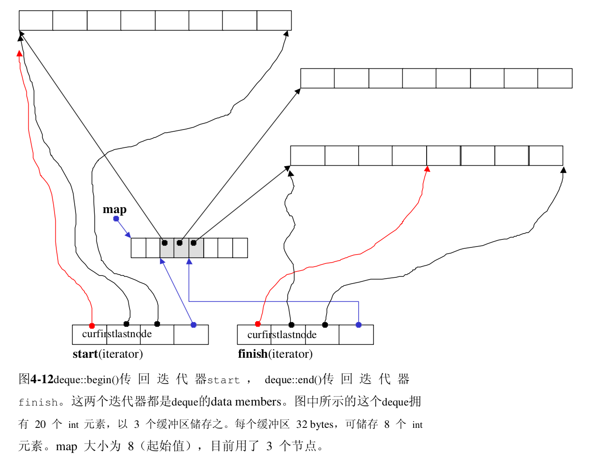

一旦行进时遇到缓冲区边缘，视前进或后退而定，可能需要调用 set_node() 切换缓冲区。

```C++
void _M_set_node(_Map_pointer __new_node)
{
	_M_node = __new_node;
	_M_first = *__new_node;
	_M_last = _M_first + difference_type(_S_buffer_size());
}
      
_Self& operator++()
{
	++_M_cur;
	if (_M_cur == _M_last)
  {
  		// 切换下一个节点（即下一个缓冲区）
	    _M_set_node(_M_node + 1);
	    _M_cur = _M_first;
  }
	return *this;
}
```

#### deque的数据结构

deque 维护 start, finish 两个迭代器，分􏰁指向第一缓冲区的第一个元素和最后缓冲区的最后一个元素（的下一位置）。

```
 struct _Deque_impl
      : public _Tp_alloc_type
{
	_Tp** _M_map;		// 指向map，一块连续的空间
	size_t _M_map_size;	// map内的节点数
	iterator _M_start;	// 第一个节点
	iterator _M_finish;	// 最后一个节点

	_Deque_impl(const _Tp_alloc_type& __a)
	: _Tp_alloc_type(__a), _M_map(0), _M_map_size(0),
	  _M_start(), _M_finish()
	{ }
};
```

有了以上的结构，很多操作便可以轻易完成：

```C++
// iterators
/**
*  Returns a read/write iterator that points to the first element in the
*  %deque.  Iteration is done in ordinary element order.
*/
iterator
  begin()
{ return this->_M_impl._M_start; }

/**
*  Returns a read/write iterator that points one past the last
*  element in the %deque.  Iteration is done in ordinary
*  element order.
*/
iterator
  end()
{ return this->_M_impl._M_finish; }
```

#### deque的构造与内存管理

deque自行定义了两个专属的空间配置器:

```C++
// 每次分配一个元素大小
typedef _Deque_base<_Tp, _Alloc>           _Base;
// 每次分配一个指针大小
typedef typename _Base::_Tp_alloc_type	 _Tp_alloc_type;
```

并提供 constructor：

```c++
explicit deque(size_type __n, const value_type& __value = value_type(),
const allocator_type& __a = allocator_type())
: _Base(__a, __n)
{ _M_fill_initialize(__value); }
```

`_M_fill_initialize()`产生并初始化后 deque 的结构：

```C++
template <typename _Tp, typename _Alloc>
    void
    deque<_Tp, _Alloc>::
    _M_fill_initialize(const value_type& __value)
    {
      _Map_pointer __cur;
      try
        {
        // 为每个节点的缓冲区设定初值
          for (__cur = this->_M_impl._M_start._M_node;
	       __cur < this->_M_impl._M_finish._M_node;
	       ++__cur)
            std::__uninitialized_fill_a(*__cur, *__cur + _S_buffer_size(),
					__value, _M_get_Tp_allocator());
        // 最后一个节点设定不同，尾端可能有备用空间，不必设初值
          std::__uninitialized_fill_a(this->_M_impl._M_finish._M_first,
				      this->_M_impl._M_finish._M_cur,
				      __value, _M_get_Tp_allocator());
        }
      catch(...)
        {
          std::_Destroy(this->_M_impl._M_start, iterator(*__cur, __cur),
			_M_get_Tp_allocator());
          __throw_exception_again;
        }
    }
```

push_back() 函数

```C++
void push_back(const value_type& __x)
{
	if (this->_M_impl._M_finish._M_cur
	    != this->_M_impl._M_finish._M_last - 1)
	  {
	  // 最后缓冲区尚有一个以上的备用空间
	    this->_M_impl.construct(this->_M_impl._M_finish._M_cur, __x);	//直接在备用空间上建构元素
	    ++this->_M_impl._M_finish._M_cur;	//调整最后缓冲区的使用状态
	  }
	else	// 最后缓冲区已无(或只剩一个)元素备用空间。
	  _M_push_back_aux(__x);
}


// 只有当 finish.cur == finish.last – 1时才会被调用。
// 即：当最后一个缓冲区只剩一个备用元素空间时才会被呼叫。
template <typename _Tp, typename _Alloc>
void deque<_Tp, _Alloc>::
    _M_push_back_aux(const value_type& __t)
{
    value_type __t_copy = __t;
    _M_reserve_map_at_back();	// // 如果 map尾端的节点备用空间不足,则必须重换一个map
    *(this->_M_impl._M_finish._M_node + 1) = this->_M_allocate_node();	//配置一个新节点(缓冲区)
    try
      {
        this->_M_impl.construct(this->_M_impl._M_finish._M_cur, __t_copy);	//针对标的元素设值
        this->_M_impl._M_finish._M_set_node(this->_M_impl._M_finish._M_node
              + 1);	//改变 finish，令其指向新节点
        this->_M_impl._M_finish._M_cur = this->_M_impl._M_finish._M_first;	//设定finish的状态
      }
    catch(...)
      {
        _M_deallocate_node(*(this->_M_impl._M_finish._M_node + 1));
        __throw_exception_again;
      }
}
```

`push_front()` 函数：

```C++
void push_front(const value_type& __x)
{
  //第一缓冲区尚有备用空间
	if (this->_M_impl._M_start._M_cur != this->_M_impl._M_start._M_first)
	  {
    	// 直接在备用空间上建构元素
	    this->_M_impl.construct(this->_M_impl._M_start._M_cur - 1, __x);
	    //调整第一缓冲区的使用状态
    	--this->_M_impl._M_start._M_cur;
	  }
	// 第一缓冲区已无备用空间
  else
	  _M_push_front_aux(__x);
}
```

#### deque的元素操作pop_back,pop_front,clear,erase,insert

所谓 pop，是将元素拿掉。无论从 deque 的最前端或最尾端取元素，都需考虑在某种条件下，将缓冲区释放掉:

```C++
void pop_front()
{
  // 第一缓冲区有一个(或更多)元素
	if (this->_M_impl._M_start._M_cur
	    != this->_M_impl._M_start._M_last - 1)
	  {
      // 将第一元素销毁
	    this->_M_impl.destroy(this->_M_impl._M_start._M_cur);
	  	// //调整指针，相当于排除了第一元素
    	++this->_M_impl._M_start._M_cur;
	  }
  // 第一缓冲区仅有一个元素，进行缓冲区的释放工作
	else
	  _M_pop_front_aux();
}

//只有当 start.cur == start.last - 1 时才会被呼叫。
template <typename _Tp, typename _Alloc>
void deque<_Tp, _Alloc>::
    _M_pop_front_aux()
{
      // 将第一缓冲区的第一个元素解构
      this->_M_impl.destroy(this->_M_impl._M_start._M_cur);
      // //释放第一缓冲区。
      _M_deallocate_node(this->_M_impl._M_start._M_first);
      //调整 start的状态
      this->_M_impl._M_start._M_set_node(this->_M_impl._M_start._M_node + 1);
      // 下一个缓冲区的第一个元素。
      this->_M_impl._M_start._M_cur = this->_M_impl._M_start._M_first;
}
```

`clear()`，用来清除整个 deque。请注意，deque 的最初状态（无任何元素时）保有一个缓冲区，因此 clear() 完成之后回复初始状态，也一样要
保留一个缓冲区:

```C++
void clear()
{ _M_erase_at_end(begin()); }

// Called by erase(q1, q2), resize(), clear(), _M_assign_aux,
// _M_fill_assign, operator=.
void _M_erase_at_end(iterator __pos)
{
	_M_destroy_data(__pos, end(), _M_get_Tp_allocator());
	// +1 的目的是：保留头尾缓冲区
  _M_destroy_nodes(__pos._M_node + 1,
			 this->_M_impl._M_finish._M_node + 1);
	this->_M_impl._M_finish = __pos;
}
```

`insert()`

```C++
template <typename _Tp, typename _Alloc>
typename deque<_Tp, _Alloc>::iterator
deque<_Tp, _Alloc>::
insert(iterator __position, const value_type& __x)
{
  // 如果插入点是 deque最前端
  if (__position._M_cur == this->_M_impl._M_start._M_cur)
	{
	  push_front(__x);
	  return this->_M_impl._M_start;
	}
  // 如果插入点是 deque最尾端
  else if (__position._M_cur == this->_M_impl._M_finish._M_cur)
	{
	  push_back(__x);
	  iterator __tmp = this->_M_impl._M_finish;
	  --__tmp;
	  return __tmp;
	}
  else
    return _M_insert_aux(__position, __x);
}


template <typename _Tp, typename _Alloc>
    typename deque<_Tp, _Alloc>::iterator
    deque<_Tp, _Alloc>::
    _M_insert_aux(iterator __pos, const value_type& __x)
    {
      // 安插点之前的元素个数
      difference_type __index = __pos - this->_M_impl._M_start;
      value_type __x_copy = __x; // XXX copy
      // 如果安插点之前的元素个数比较少
      if (static_cast<size_type>(__index) < size() / 2)
      {
        // 在最前端加入与第一元素同值的元素。
        push_front(front());
        // 以下标示记号，然后进行元素搬移...
        iterator __front1 = this->_M_impl._M_start;
        ++__front1;
        iterator __front2 = __front1;
        ++__front2;
        __pos = this->_M_impl._M_start + __index;
        iterator __pos1 = __pos;
        ++__pos1;
        // 元素搬移
        std::copy(__front2, __pos1, __front1);
      }
      else	//安插点之后的元素个数比较少
      {
        push_back(back());	// 最尾端插入与最后元素同值的元素
        iterator __back1 = this->_M_impl._M_finish;
        --__back1;
        iterator __back2 = __back1;
        --__back2;
        __pos = this->_M_impl._M_start + __index;
        // 元素搬移
        std::copy_backward(__pos, __back2, __back1);
      }
      // 在插入点设定新值
      *__pos = __x_copy;
      return __pos;
    }
```

### stack

stack 是一种先进后出（First In Last Out，FILO）的数据结构，它只有一个出口。stack 允许新增元素、移除元素、取得最顶端元素。但除了最顶端外，没有任何其它方法可以存取 stack 的其它元素。

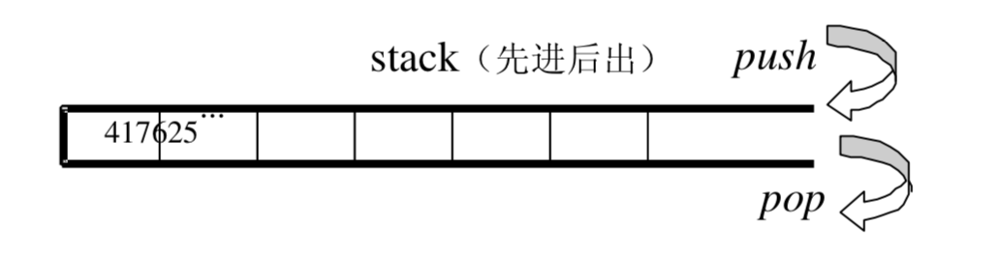

#### stack定义式完整列表

以某种既有容器做为底部结构，将其接口改变，使符合「先进后出」的特性，形
成一个 stack，是很容易做到的。deque 是双向开口的数据结构，若以 deque 为
底部结构并封闭其头端开口，便轻而易举地形成了一个 stack。

```
template<typename _Tp, typename _Sequence = deque<_Tp> >
class stack
{
 protected:
      //  底层容器
    _Sequence c;
};
```

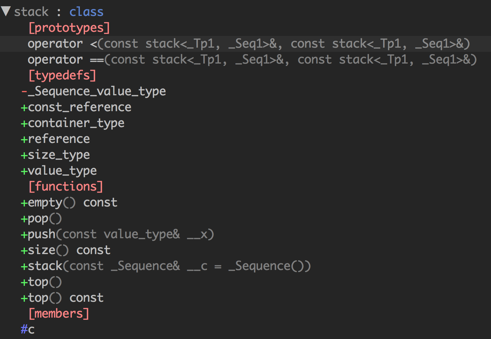

```C++
/** Returns true if the %stack is empty. */
bool empty() const
{ return c.empty(); }

/**  Returns the number of elements in the %stack.  */
size_type size() const
{ return c.size(); }

```

#### stack没有迭代器

stack 所有元素的进出都必须符合「先进后出」的条件，只有 stack 顶端的元素，才有机会被外界取用。 不提供迭代器。

#### 以list为stack的底层容器

除了deque 之外，list 也是双向开口的数据结构。上述 stack 源码中使用的底层容器的函数有 empty, size, back, push_back, pop_back，list 都具备。

### queue

queue 是一种先进先出（First In First Out，FIFO）的数据结构，它有两个出口。

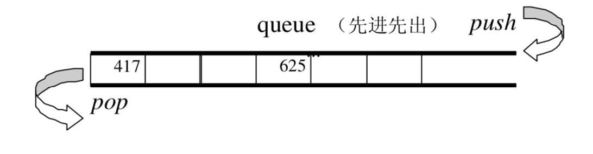

queue 只能从一端插入，另一端删除。除了最底端可以加入、最顶端可以取出，没有任何其它方法可以存取 queue 的其它元素。

#### queue定义式完整列表

SGI STL 便以 deque 做为预设情况下的 queue 底层结构。

```C++
template<typename _Tp, typename _Sequence = deque<_Tp> >
class queue
{
protected:
	// 底层容器
  _Sequence c;
};
```

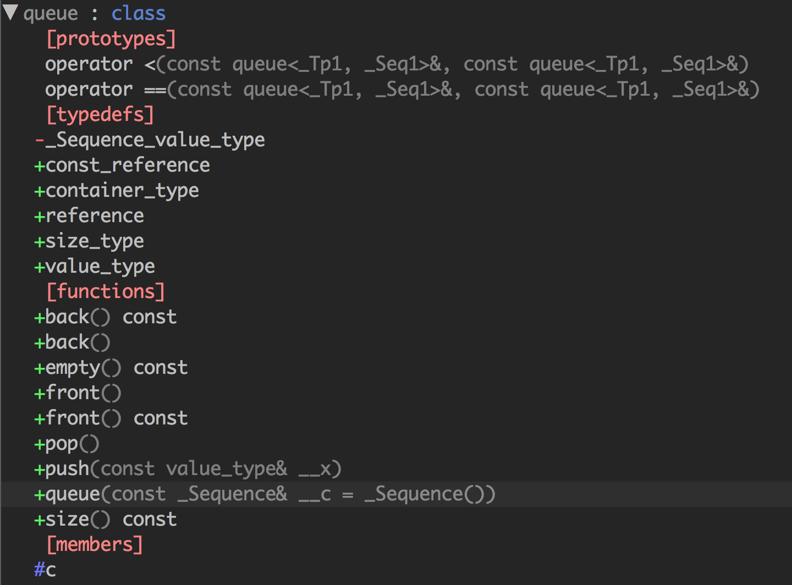

```C++
void push(const value_type& __x)
{ 
	c.push_back(__x);
}
      
void pop()
{
  __glibcxx_requires_nonempty();
  c.pop_front();
}
```

#### queue没有迭代器

queue 所有元素的进出都必须符合「先进先出」的条件，只有 queue 顶端的元素，才有机会被外界取用。 

#### 以list做为queue的底层容器

除了deque 之外，list 也是双向开口的数据结构。上述 queue 源码中使用的底层容器的函数有 empty, size, back, push_back, pop_back，list 都具备。

### heap

heap 并不归属于 STL 容器组件，它的背后是 priority queue（优先队列）。priority queue 允许使用者以任何次序将任何元素推入容器内，但取出时一定是从优先权最高的元素开始取。

使用 list 做为 priority queue 的底层机制，元素插入动作可享常数时间。但是要找到 list 中的极值，却需要对整个 list 进行线性扫描。

使用 binary search tree 做为 priority queue 的底层机制，元素的插入和极值的取得就有 O(logN) 的表现。但是这需要确保输入数据的随机性。

priority queue 的复杂度，最好介于 queue 和 binary search tree之间，才算适得其所。binary heap 便是这种条件下的适当候选人。

binary heap 是一颗完全二叉树。当完全二叉树中的某个节点位于 array 的 i 处，其左子节点必位于 array 的 2i+1 处，其右子节点必位于 array 的 2i+2 处（这里的索引从 0 开始）。

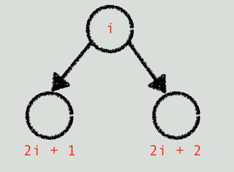

其父节点必定是 ⌊(i - 1)/2⌋。

根据元素排列方式，heap 可分为 max-heap 和 min-heap 两种，max-heap 的最大值在根节点，min-heap 的最小值在根节点。

#### heap算法

**push_heap**

为了保持完全二叉树的性质，应该将新元素插入在底层 vector 的 end() 处。

```C++
template<typename _RandomAccessIterator>
inline void
push_heap(_RandomAccessIterator __first, _RandomAccessIterator __last)
{
  std::__push_heap(__first, _DistanceType((__last - __first) - 1),
  _DistanceType(0), _ValueType(*(__last - 1)));
}


template<typename _RandomAccessIterator, typename _Compare>
inline void
push_heap(_RandomAccessIterator __first, _RandomAccessIterator __last,
    _Compare __comp)
{
	// 值必置于底部 -> 容器的最尾端
  std::__push_heap(__first, _DistanceType((__last - __first) - 1),
 	_DistanceType(0), _ValueType(*(__last - 1)), __comp);
}

// 不允许指定，（大小比较标准）
template<typename _RandomAccessIterator, typename _Distance, typename _Tp,
    typename _Compare>
  void
    __push_heap(_RandomAccessIterator __first, _Distance __holeIndex,
		_Distance __topIndex, _Tp __value, _Compare __comp)
{
    _Distance __parent = (__holeIndex - 1) / 2;	// 父节点
    while (__holeIndex > __topIndex	
     && __comp(*(__first + __parent), __value))
    {
      // 当尚􏰃到达顶端，且父节点小于新值
      *(__first + __holeIndex) = *(__first + __parent);
      __holeIndex = __parent;
      __parent = (__holeIndex - 1) / 2;
    }
    *(__first + __holeIndex) = __value;
}

```

**pop_heap**

pop 动作取走根节点，必须将最下一层最右边的叶节点拿来填补跟节点的位置，并维护堆的性质。
```C++
template<typename _RandomAccessIterator>
    inline void
    pop_heap(_RandomAccessIterator __first, _RandomAccessIterator __last)
    {
      std::__pop_heap(__first, __last - 1, __last - 1,
          _ValueType(*(__last - 1)));
    }

template<typename _RandomAccessIterator, typename _Compare>
    inline void
    pop_heap(_RandomAccessIterator __first,
       _RandomAccessIterator __last, _Compare __comp)
    {
      std::__pop_heap(__first, __last - 1, __last - 1,
          _ValueType(*(__last - 1)), __comp);
    }

template<typename _RandomAccessIterator, typename _Tp>
    inline void
    __pop_heap(_RandomAccessIterator __first, _RandomAccessIterator __last,
         _RandomAccessIterator __result, _Tp __value)
    {
      typedef typename iterator_traits<_RandomAccessIterator>::difference_type
  _Distance;
      // 设定尾值为首值，于是尾值即为欲求结果
      // 可由客端稍后再以底层容器之 pop_back() 取出尾值。  
      *__result = *__first;
      // 以上欲重新调整 heap
      std::__adjust_heap(__first, _Distance(0), _Distance(__last - __first),
       __value);
    }


template<typename _RandomAccessIterator, typename _Distance,
     typename _Tp, typename _Compare>
    void
    __adjust_heap(_RandomAccessIterator __first, _Distance __holeIndex,
      _Distance __len, _Tp __value, _Compare __comp)
{
      const _Distance __topIndex = __holeIndex;
      _Distance __secondChild = 2 * __holeIndex + 2;  // 右节点
      while (__secondChild < __len)
  {
    if (__comp(*(__first + __secondChild),
         *(__first + (__secondChild - 1))))
      __secondChild--;  // 减1后为左节点

    // secondChild代表较大子节点
    *(__first + __holeIndex) = *(__first + __secondChild);
    __holeIndex = __secondChild;
    __secondChild = 2 * (__secondChild + 1);
  }
      // 如果没有右节点，只有左子节点
      if (__secondChild == __len)
  {
    *(__first + __holeIndex) = *(__first + (__secondChild - 1));
    __holeIndex = __secondChild - 1;
  }
      std::__push_heap(__first, __holeIndex, __topIndex, __value, __comp);
}
```

pop_heap 之后，最大元素只是被置放于底部容器的最尾端，尚􏰃被取走。如果要取其值，可使用底部容器（vector）所提供的 back() 操作函数。如果要移除它，可使用底部容器（vector）所提供的 pop_back() 操作函式。

**sort_heap**
排序过后，原来的 heap 就不再是个合法的 heap 了。
```C++
// 每执行一次 pop_heap()，极值(在 STL heap 中为极大值)即被放在尾端。 
// 扣除尾端再执行一次 pop_heap()，次极值又被放在新尾端。一直下去，最后即得
// 排序结果。
  template<typename _RandomAccessIterator>
    void
    sort_heap(_RandomAccessIterator __first, _RandomAccessIterator __last)
    {
      while (__last - __first > 1)
      std::pop_heap(__first, _RandomAccessIterator(__last--));
    }
```

**make_heap**
这个算法用来将一段现有的数据转化为一个 heap。
```
template<typename _RandomAccessIterator>
    void
    make_heap(_RandomAccessIterator __first, _RandomAccessIterator __last)
    {
      // 如果长度为 0或 1，不必重新排列。
      if (__last - __first < 2)
        return;

      const _DistanceType __len = __last - __first;
      _DistanceType __parent = (__len - 2) / 2;
      while (true)
  {
    std::__adjust_heap(__first, __parent, __len,
           _ValueType(*(__first + __parent)));
    if (__parent == 0)
      return;
    __parent--;
  }
    }
```

#### heap也没有迭代器

### priority_queue
priority_queue 是一个拥有权值观念的 queue，它允许加入新元素、移除旧元素，审视元素值等功能。由于这是一个 queue，所以只允许在底端加入元素，并从顶端取出元素，除此之外􏰁无其它存取元素的途径。

```
template<typename _Tp, typename _Sequence = vector<_Tp>,
     typename _Compare  = less<typename _Sequence::value_type> >
    class priority_queue
    {
    protected:
      // vector为底层容器
      _Sequence  c;
      _Compare   comp;  // 元素大小的比较标准

      // ....
    };
```
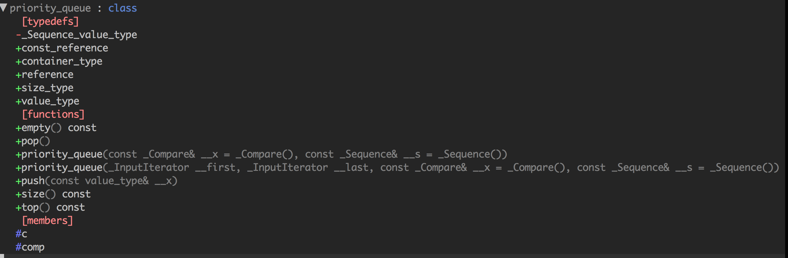
#### priority_queue也没有迭代器

### slist
STL list 是个双向链表（double linked list）。SGI STL 另提供了一个单向串行（single linked list），名为slist。
slist 和 list 的主要差􏰁在于，前者的迭代器属于单向的 Forward  Iterator，后者的迭代器属于双向的 Bidirectional Iterator。
slist 和 list 共同具有的一个相同特色是，它们的插入（insert）、移除（erase）、接合（splice）等动作并不会造成原有的迭代器失效。

基于效率考虑，slist 不提供 push_back()，只提供 push_front()。

#### slist的节点
```C++
// 单向串行的节点基􏰀结构
  struct _Slist_node_base
  {
    _Slist_node_base* _M_next;
  };

  // 单向串行的节点结构
  template <class _Tp>
  struct _Slist_node : public _Slist_node_base
  {
    _Tp _M_data;
  };

  //已知某一节点，安插新节点于其后。
    inline _Slist_node_base*
  __slist_make_link(_Slist_node_base* __prev_node,
        _Slist_node_base* __new_node)
  {
    __new_node->_M_next = __prev_node->_M_next;
    __prev_node->_M_next = __new_node;
    return __new_node;
  }

  // 反转一个链表
    inline _Slist_node_base*
  __slist_reverse(_Slist_node_base* __node)
  {
    _Slist_node_base* __result = __node;
    __node = __node->_M_next;
    __result->_M_next = 0;
    while(__node)
      {
  _Slist_node_base* __next = __node->_M_next;
  __node->_M_next = __result;
  __result = __node;
  __node = __next;
      }
    return __result;
  }

```
### slist的迭代器
```C++
//单向串行的迭代器基􏰀结构
 struct _Slist_iterator_base
  {
    typedef size_t                    size_type;
    typedef ptrdiff_t                 difference_type;
    typedef std::forward_iterator_tag iterator_category;  // 单向

     _Slist_node_base* _M_node; //指向节点基􏰀结构

    void _M_incr()  // // 前进一个节点
    { _M_node = _M_node->_M_next; }

    // ....


  };

  //单向串行的迭代器结构
  template <class _Tp, class _Ref, class _Ptr>
    struct _Slist_iterator : public _Slist_iterator_base
    {
      typedef _Slist_iterator<_Tp, _Tp&, _Tp*>             iterator;
      typedef _Slist_iterator<_Tp, const _Tp&, const _Tp*> const_iterator;
      typedef _Slist_iterator<_Tp, _Ref, _Ptr>             _Self;

      _Self&
      operator++()
      {
        _M_incr();  // //前进一个节点
        return *this;
      }

      _Self
      operator++(int)
      {
        _Self __tmp = *this;
        _M_incr();  // //前进一个节点
        return __tmp;
      }
    };
```

#### slist的数据结构
```C++
template <class _Tp, class _Alloc = allocator<_Tp> >
  class slist : private _Slist_base<_Tp,_Alloc>
  {
      // concept requirements
      __glibcxx_class_requires(_Tp, _SGIAssignableConcept)
  
    private:
      typedef _Slist_base<_Tp,_Alloc> _Base;

    public:
      typedef _Tp               value_type;
      typedef value_type*       pointer;
      typedef const value_type* const_pointer;
      typedef value_type&       reference;
      typedef const value_type& const_reference;
      typedef size_t            size_type;
      typedef ptrdiff_t         difference_type;
      
      typedef _Slist_iterator<_Tp, _Tp&, _Tp*>             iterator;
      typedef _Slist_iterator<_Tp, const _Tp&, const _Tp*> const_iterator;
      
      typedef typename _Base::allocator_type allocator_type;
   private:
      typedef _Slist_node<_Tp>      _Node;
      typedef _Slist_node_base      _Node_base;
      typedef _Slist_iterator_base  _Iterator_base;
      
      _Node*
      _M_create_node(const value_type& __x)
      {
        // 配置空间
      _Node* __node = this->_M_get_node();
    try
      {
        // 构造元素
        get_allocator().construct(&__node->_M_data, __x);
        __node->_M_next = 0;
      }
  catch(...)
    {
      this->_M_put_node(__node);
      __throw_exception_again;
    }
  return __node;
      }
  };

  iterator
      begin()
      { return iterator((_Node*)this->_M_head._M_next); }
  
  iterator
      end()
      { return iterator(0); }

  bool
      empty() const
      { return this->_M_head._M_next == 0; }

  void
      swap(slist& __x)
      { std::swap(this->_M_head._M_next, __x._M_head._M_next); }

  // 取头部元素    
  reference
      front()
      { return ((_Node*) this->_M_head._M_next)->_M_data; }

  // 删除头部元素
  void
      pop_front()
      {
  _Node* __node = (_Node*) this->_M_head._M_next;
  this->_M_head._M_next = __node->_M_next;
  get_allocator().destroy(&__node->_M_data);
  this->_M_put_node(__node);
      }
};
```

